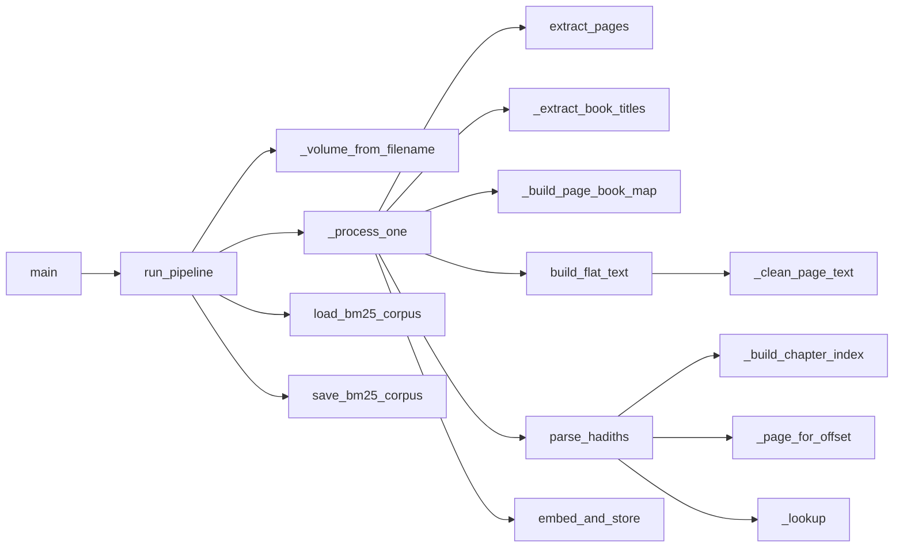
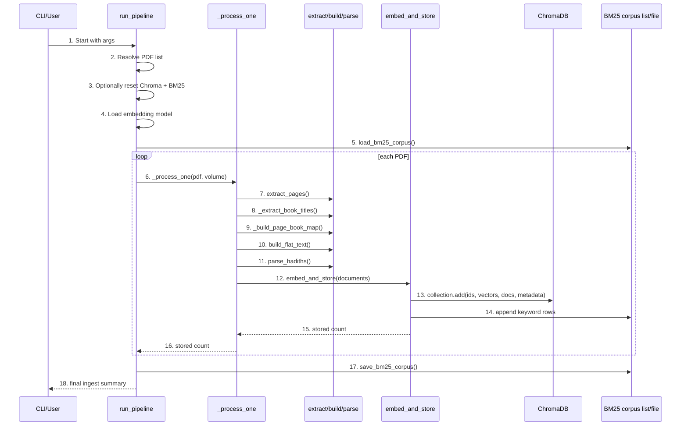

# ingest_bukhari_v1_lc.py Detailed Diagram and Code Flow

This document explains what the ingestion pipeline does in normal processing mode, which model and algorithms it uses, and what actions are performed from input PDFs to stored retrieval data.

## 1) High-Level Architecture

```mermaid
flowchart TD
    A[CLI args\n--reset --file] --> B[run_pipeline]

    B --> C{Select PDFs}
    C -->|--file| C1[Single PDF path resolve]
    C -->|default| C2[Glob data/bukhari/*.pdf]

    B --> E[Optional reset:\ndelete Chroma collection\ndelete BM25 file]
    B --> F[Load embedding model]
    B --> G[Load BM25 corpus from disk]

    C1 --> I[Loop PDF files]
    C2 --> I
    G --> I

    I --> J[_process_one(pdf, volume)]

    J --> K[extract_pages]
    K --> L[_extract_book_titles]
    K --> M[_build_page_book_map]
    K --> N[build_flat_text\nwith cleaned page text + offsets]

    N --> O[parse_hadiths]
    L --> O
    M --> O

    O --> P{documents found?}
    P -->|No| P1[warn and skip]
    P -->|Yes| R[embed_and_store]

    R --> S[Create/open Chroma collection]
    S --> T[Batch dedupe IDs]
    T --> U[Embed text batch]
    U --> V[collection.add ids+vectors+docs+metadata]
    V --> W[Append rows to bm25_corpus]

    R --> X[return stored count]
    P1 --> X

    X --> Y[Accumulate grand total]
    Y --> Z1[save_bm25_corpus]
    Z1 --> Z2[Print final summary paths]
```

## 2) Function-Level Call Flow



## 3) Sequence Diagram (Runtime Behavior with Step Numbers)



## 4) Model and Algorithms Used

- Embedding model: `HuggingFaceEmbeddings` initialized with `model_name=EMBED_MODEL` and `normalize_embeddings=True`.
- Vector similarity backend: ChromaDB persistent collection with `hnsw:space = cosine`.
- Lexical retrieval data format: BM25 corpus rows persisted via `save_bm25_corpus()`.
- Text segmentation algorithm: regex boundary detection on hadith markers (`N. Narrated ...`).
- Metadata lookup algorithm: binary search (`bisect_right`) on sorted offsets/chapter starts.
- Deduplication algorithm: set-based duplicate ID checks across existing corpus and current batch.

## 5) Data Structures and Why They Exist

### pages
- Type: `list[dict]`
- Shape: `[{"page": int, "text": str}, ...]`
- Why: keeps raw page text with explicit page numbers for downstream metadata mapping.

### offsets
- Type: `list[tuple[int, int]]`
- Shape: `[(flat_start_offset, page_number), ...]`
- Why: converts hadith text offsets to original PDF pages with fast binary search.

### book_titles
- Type: `dict[int, str]`
- Shape: `{book_num: "The Book of ..."}`
- Why: stores canonical human-readable book titles.

### page_book_map
- Type: `dict[int, int]`
- Shape: `{page_num: book_num}`
- Why: maps each page to its active book number using running headers.

### chapter_map and chapter_starts
- Types: `dict[int, tuple[int, str]]` and `list[int]`
- Why: resolves chapter metadata from the nearest preceding chapter marker.

### documents
- Type: `list[Document]` (LangChain)
- Why: represents one parsed hadith per document with retrieval metadata.

### bm25_corpus
- Type: `list[dict]`
- Shape per row: `{id, text, source, page, reference}`
- Why: stores lexical retrieval rows for BM25-style keyword ranking, separate from vectors.

### existing_ids
- Type: `set[str]`
- Why: prevents duplicate insertion across batches and repeated runs.

## 6) Steps Taken by the Pipeline

1. Gather target PDFs (`--file` or all in data/bukhari).
2. Optional reset deletes old Chroma collection and BM25 file.
3. Load embedding model and existing BM25 corpus rows.
4. For each PDF:
   - Determine volume from filename.
   - Extract raw text for every page.
    - Build book-title index and page-to-book map from running headers.
    - Clean page text (remove headers/noise), flatten text, and track page offsets.
   - Detect hadith boundaries and parse hadith blocks.
    - Build per-hadith metadata: volume, book, chapter, reference, page, narrator, source.
    - Generate embeddings for hadith texts.
    - Add IDs, embeddings, text, and metadata to ChromaDB.
    - Append lexical rows to BM25 corpus list.
5. Persist BM25 corpus to disk and print summary.

## 7) What Has Been Done (Output Artifacts)

- Vector data has been written to the persistent Chroma collection named by `COLLECTION` under `CHROMA_DIR`.
- Lexical keyword data has been written to `BM25_FILE` via `save_bm25_corpus()`.
- Every stored hadith has:
  - a stable ID format: `filename__vN_bNN_hNNNN`
  - source text body
  - retrieval metadata (`reference`, `page`, `source`, book/chapter fields)
- Duplicate entries are skipped through `existing_ids` and per-batch dedupe checks.

## 8) Storage Split (Hybrid Retrieval)

- Vector side (semantic): Chroma collection stores embeddings + documents + metadata.
- Keyword side (lexical): BM25 corpus file stores plain text rows for term-frequency retrieval.
- Both together enable hybrid retrieval: semantic similarity plus exact keyword matching.

## 9) Error/Skip Paths

- If Bukhari data directory does not exist: exit with error.
- If no PDFs found: exit with error.
- If volume cannot be parsed from filename: skip file with warning.
- If a PDF yields no hadith boundaries: skip with warning.
- Duplicate IDs: skipped during batch ingestion.
