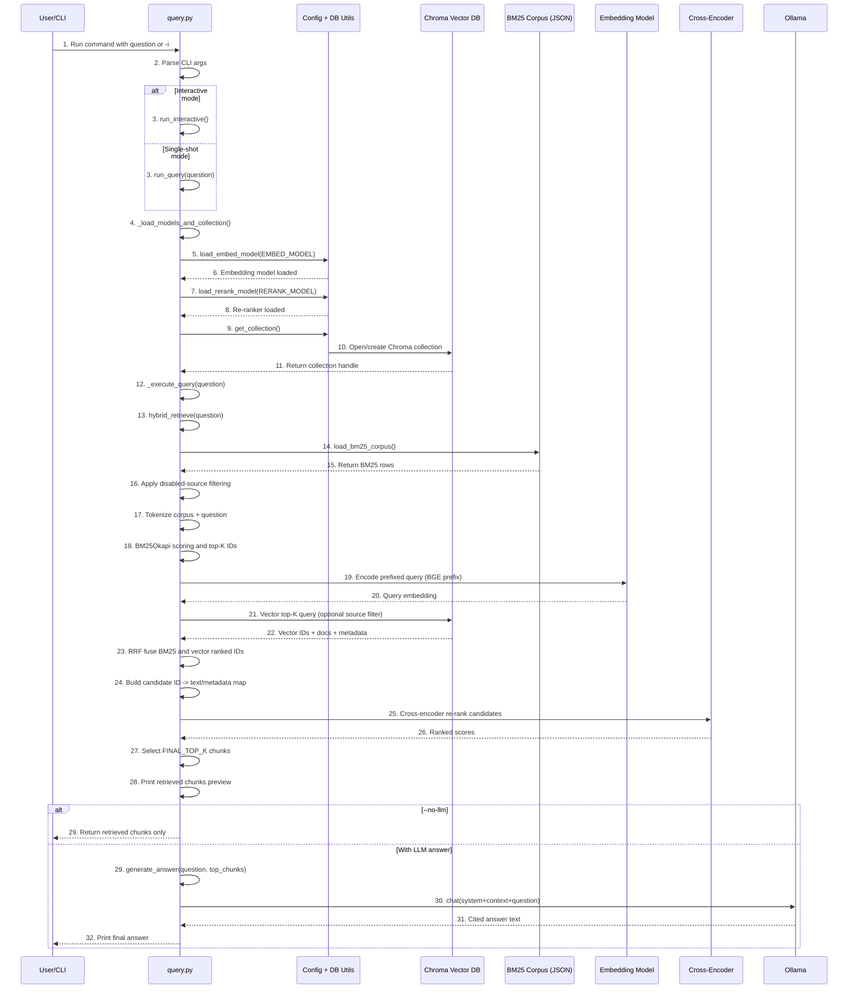
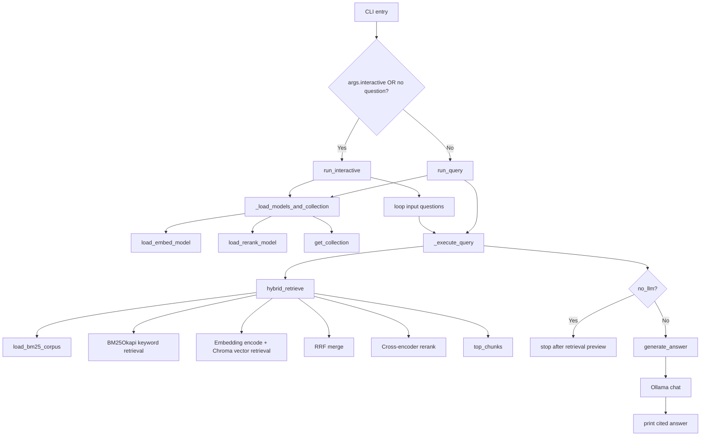

# query.py Sequence Diagram and Code Flow

This document explains how `query.py` executes from CLI input to retrieved chunks and final answer generation.

## 1) End-to-End Sequence Diagram

## 2) Code Flow (Function by Function)

## 3) Algorithms and Models Used

- Lexical retrieval: `BM25Okapi` from `rank_bm25`.
- Semantic retrieval: embedding vector search against Chroma collection.
- Query embedding: `SentenceTransformer` loaded via `load_embed_model(EMBED_MODEL)`.
- BGE retrieval trick: prefixes query with `BGE_QUERY_PREFIX` before embedding.
- Fusion: Reciprocal Rank Fusion (RRF) with standard constant `k=60`.
- Final ranking: `CrossEncoder` loaded via `load_rerank_model(RERANK_MODEL)`.
- Answer generation: Ollama chat using `OLLAMA_MODEL` at `OLLAMA_HOST`.

## 4) What the Pipeline Actually Does

1. Loads models and vector collection once (especially useful for interactive mode).
2. Reads the persisted BM25 corpus JSON from disk.
3. Runs two retrieval paths in parallel logic:
   - Keyword path: BM25 top candidates.
   - Semantic path: vector top candidates from Chroma.
4. Merges candidate IDs via RRF.
5. Re-ranks merged candidates with a cross-encoder.
6. Displays the best chunks with source/page/reference metadata.
7. Optionally sends context to Ollama and prints a cited final answer.

## 5) Key Inputs and Outputs

- Input:
  - User question string.
  - Chroma collection documents and metadata.
  - BM25 corpus JSON rows.

- Output:
  - `top_chunks`: best retrieved passages after hybrid + rerank.
  - Optional final natural-language answer with citations.

## 6) Important Runtime Branches

- If vector DB is empty: exits and asks to ingest first.
- If BM25 corpus is empty: warns and returns no results.
- If all sources are disabled by filter: warns and returns no results.
- If `--no-llm` is set: retrieval only, no generation.
